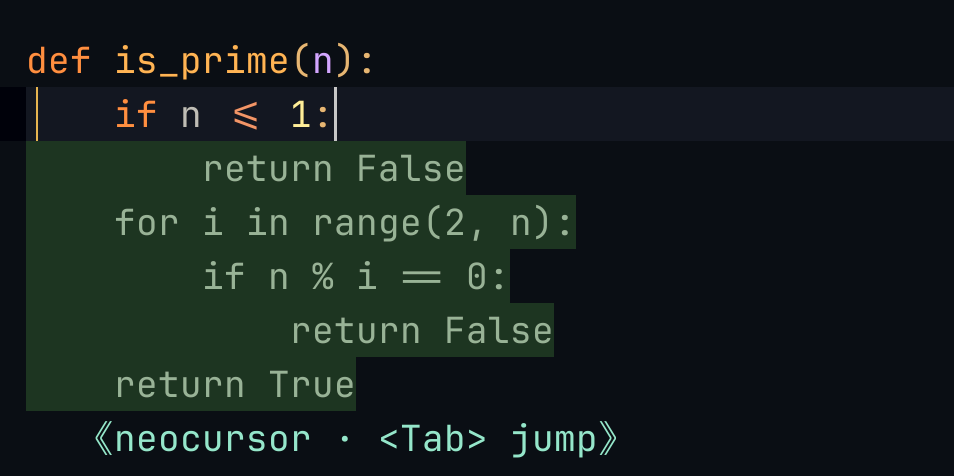

# neocursor.nvim

**Cursor's Tab — the real next-edit model — inside Neovim.**

No API key. No model to choose. No account to create. If you're already signed
into Cursor, there is nothing else to set up — neocursor drives Cursor's own
`StreamCpp` backend with your existing login, so you get the *same* predictions,
at the *same* latency, as Cursor itself.

<p align="center">
  
</p>

<p align="center">
  <sub>Typed <code>def is_prime(n):</code> — Cursor predicted the whole body.
  <code>&lt;Tab&gt;</code> accepts · <code>&lt;Tab&gt;</code> again jumps to the next edit.</sub>
</p>

> ⚠️ **Beta.** The goal is 1:1 parity with Cursor's Tab. We're most of the way
> there — see [parity](#cursor-tab-parity) for exactly what's ported and what isn't.

---

## Requirements

That's the whole list — **there is no additional configuration:**

- **Neovim ≥ 0.10**
- **Cursor, installed and signed in** (the desktop app). neocursor reads your
  existing session — no token to paste, no API key, no separate subscription.
- **[`uv`](https://github.com/astral-sh/uv)** on your `PATH` (the Python sidecar
  runs via `uv`; it fetches its own deps on first run — nothing to `pip install`).

**macOS, Linux and Windows.** The sidecar finds Cursor's signed-in session
wherever your platform puts it:

| | Cursor data dir |
|---|---|
| macOS | `~/Library/Application Support/Cursor` |
| Linux | `$XDG_CONFIG_HOME/Cursor` → `~/.config/Cursor` |
| Windows | `%APPDATA%\Cursor` |

Insiders builds and the lowercase `cursor` directory some Linux packages create
are detected too. If your install lives somewhere else — a portable copy, a
Flatpak/Snap sandbox, or Windows-side Cursor seen from WSL — point the sidecar
at it:

```sh
export CURSOR_CONFIG_DIR="/mnt/c/Users/me/AppData/Roaming/Cursor"   # WSL example
# or aim straight at the SQLite file:
export CURSOR_STATE_DB_PATH="/path/to/User/globalStorage/state.vscdb"
```

Not sure what it's resolving? `uv run cursor_paths.py` in the plugin directory
prints every path it checks — paste that into a bug report.

---

## Install

**lazy.nvim** — this is the entire setup:

```lua
{
  "teocns/neocursor.nvim",
  event = "InsertEnter",
  -- pre-warm the sidecar (double quotes so cmd.exe and sh both parse it)
  build = 'uv run --with "httpx[http2]" python -c "import httpx"',
  opts = {},
}
```

No tokens, no `setup()` arguments required. Open a file, start typing, pause →
ghost text → `<Tab>`.

**vim.pack** (built into Neovim ≥ 0.12) — the minimal setup:

```lua
vim.pack.add { "https://github.com/teocns/neocursor.nvim" }
require("neocursor").setup {}
```

<details>
<summary>vim.pack: full parity with the lazy.nvim spec (pre-warm + lazy start)</summary>

The lazy.nvim spec above pre-warms the sidecar's Python deps at install time
(`build`) and defers startup to insert mode (`event`). The vim.pack equivalent:

```lua
-- pre-warm the sidecar's deps on install/update (lazy.nvim's `build`).
-- Register this BEFORE vim.pack.add so it sees the initial install.
vim.api.nvim_create_autocmd("PackChanged", {
  callback = function(ev)
    if ev.data.spec.name ~= "neocursor.nvim" then return end
    if ev.data.kind == "install" or ev.data.kind == "update" then
      vim.system { "uv", "run", "--with", "httpx[http2]", "python", "-c", "import httpx" }
    end
  end,
})

vim.pack.add { "https://github.com/teocns/neocursor.nvim" }

-- start on first insert (lazy.nvim's `event = "InsertEnter"`)
vim.api.nvim_create_autocmd("InsertEnter", {
  once = true,
  callback = function() require("neocursor").setup {} end,
})
```

Skipping the pre-warm is fine — the sidecar fetches its own deps on first
launch; the first suggestion just arrives a few seconds later.

</details>

<details>
<summary>Letting nvim-cmp / blink.cmp own <code>&lt;Tab&gt;</code></summary>

If another plugin already maps `<Tab>`, set `map_tab = false` and fall through
to neocursor from your own handler:

```lua
{ "teocns/neocursor.nvim", event = "InsertEnter", opts = { map_tab = false } }

-- in your <Tab> mapping, try neocursor first:
if require("neocursor").accept() then return end
-- …otherwise let cmp/blink handle it
```

</details>

<details>
<summary>Pinning a version</summary>

```lua
{ "teocns/neocursor.nvim", version = "*" } -- latest tagged release instead of main
```

With vim.pack, `version` takes a tag, branch, commit hash, or
`vim.version.range()`:

```lua
vim.pack.add { { src = "https://github.com/teocns/neocursor.nvim", version = vim.version.range "*" } }
```

</details>

---

## Cursor Tab parity

The goal is a **1:1 port of Cursor's Tab**. This is a beta, so here's the honest
scoreboard — what actually made it across, and what's still in flight:

| Cursor Tab capability | neocursor |
|---|:---:|
| Inline multi-line completions (ghost text) | ✅ |
| Diff-style rewrites of existing lines | ✅ |
| **Next-edit prediction + cursor jump** (the tab-tab-tab flow) | ✅ |
| Multi-edit chains — one `<Tab>` per edit, no extra round-trips | ✅ |
| Recent-edit / diff-history context | ✅ |
| Nearby-file + linter-error context | ✅ |
| Request gating — stays quiet while you read/navigate | ✅ |
| Partial accept (word-by-word) | ✅ |
| Config pulled live from Cursor (`CppConfig`: debounce, heuristics) | ✅ |
| Character-level diffs for single-character edits | 🚧 |
| Cross-file *apply* on jump targets | 🚧 partial — jump lands, chain is partial |
| macOS / Linux / Windows auth paths | ✅ |

<sub>✅ ported · 🚧 in progress</sub>

The core loop — predict, ghost, `<Tab>`, jump, chain — is complete and running on
Cursor's actual backend. The 🚧 rows are edges, not the main path.

---

## Usage

Type, pause, and a suggestion appears. Then:

| Key / Command | Does |
|---|---|
| `<Tab>` | Accept · or **jump** to the predicted next edit · or chain to the next one |
| `<M-Right>` | Accept the suggestion word-by-word |
| `<C-]>` | Dismiss |
| `:NeocursorSuggest` | Force a request right now |
| `:NeocursorLog` | Toggle the live state dashboard |
| `:NeocursorDebug` | Print diagnostics |

**The tab-tab-tab flow:** accept a completion → if Cursor predicts an edit
elsewhere, the ghost turns into a `Tab →` hint → next `<Tab>` *jumps* your cursor
there → the one after *accepts*. Exactly Cursor's rhythm.

<details>
<summary>Configuration (all optional)</summary>

```lua
require("neocursor").setup({
  debounce    = 250,          -- ms; overridden by Cursor's CppConfig at startup
  map_tab     = true,         -- false → another plugin owns <Tab>
  map_partial = "<M-Right>",  -- word-by-word accept
  filetypes   = nil,          -- allow-list, e.g. { "python", "lua" }; nil = all
})
```

</details>

---

## How it works

neocursor doesn't reimplement or retrain a model — it *is* Cursor's Tab, reached
through a tiny stdio bridge:

```
  Neovim (Lua) ──JSON──▶ sidecar.py ──Connect/protobuf over h2──▶ Cursor StreamCpp
   render + <Tab>          reads your Cursor token,                (api2.cursor.sh)
   accept + jump           forges the checksum, streams edits
```

The sidecar reads your local Cursor session, speaks the exact `StreamCpp` call
Cursor's own client makes, and streams back the edit sequence plus the next
cursor-jump target. See [`NOTICE`](./NOTICE) for rendering-technique attribution.

---

## Legal

Independent, **personal-use interoperability** project — not affiliated with
Anysphere / Cursor. It uses *your own* account; the token never leaves your
machine. It talks to Cursor's private API, which is undocumented and may change,
and using it may not fit Cursor's ToS — that's between you and Cursor. No Cursor
source is redistributed. Use at your own risk.

## License

[MIT](./LICENSE). Rendering-technique attribution lives in [`NOTICE`](./NOTICE).
