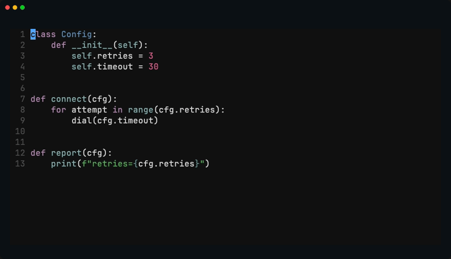
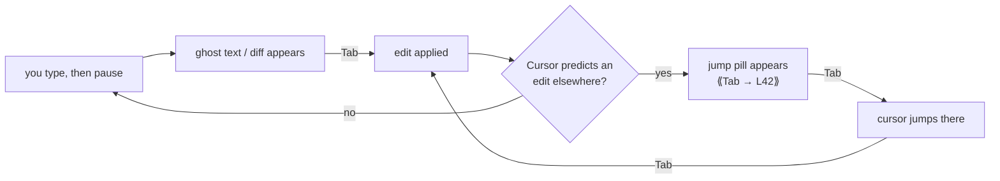
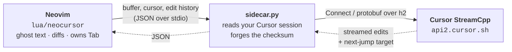

<h1 align="center">neocursor.nvim</h1>

<p align="center">
  <b>Cursor's Tab — the real next-edit model — inside Neovim.</b>
</p>

<p align="center">
  <a href="https://github.com/teocns/neocursor.nvim/actions/workflows/ci.yml">
    </a>
  <a href="https://github.com/teocns/neocursor.nvim/releases/latest">
    </a>
  
  
  <a align="center" href="./LICENSE">
    </a>
</p>

<p align="center">
  
</p>

<p align="center">
<a href="https://github.com/dizzi1222/nvim">
  
  
  
  
  
</a>
</p>

<p align="center">
  <sub>Renamed one field on line 3. The two call sites below are now stale.
  <code>&lt;Tab&gt;</code> jumps to each one · <code>&lt;Tab&gt;</code> again accepts the rewrite.</sub>
</p>

No API key. No model to choose. No account to create. If you're already signed
into Cursor, there is nothing else to set up — neocursor drives Cursor's own
`StreamCpp` backend with your existing login, so you get the *same* predictions,
at the *same* latency, as Cursor itself.

> [!WARNING]
> **Beta.** The goal is 1:1 parity with Cursor's Tab, and most of it is there.
> See [Cursor Tab parity](#cursor-tab-parity) for the honest scoreboard.

<p align="center">
  <a href="#requirements">Requirements</a> ·
  <a href="#installation">Installation</a> ·
  <a href="#usage">Usage</a> ·
  <a href="#configuration">Configuration</a> ·
  <a href="#cursor-tab-parity">Parity</a> ·
  <a href="#how-it-works">How it works</a> ·
  <a href="#troubleshooting">Troubleshooting</a>
</p>

---

## Requirements

- **Neovim ≥ 0.10**
- **Cursor, installed and signed in** (the desktop app) — neocursor reads your
  existing session. No token to paste, no API key, no separate subscription.
- **[`uv`](https://github.com/astral-sh/uv)** on your `PATH` — the Python sidecar
  runs through it and fetches its own deps. Nothing to `pip install`.

Works on **macOS, Linux and Windows**; the sidecar finds Cursor's session
wherever your platform puts it. Portable install, Flatpak/Snap, or WSL? See
[Cursor can't be found](./docs/troubleshooting.md#cursor-cant-be-found).

---

## Installation

### lazy.nvim

```lua
{
  "teocns/neocursor.nvim",
  event = "InsertEnter",
  -- pre-warm the sidecar (double quotes so cmd.exe and sh both parse it)
  build = 'uv run --with "httpx[http2]" python -c "import httpx"',
  opts = {},
}
```

That's the entire setup. No tokens, no required `setup()` arguments — open a
file, start typing, pause → ghost text → `<Tab>`.

### vim.pack

Built into Neovim ≥ 0.12:

```lua
vim.pack.add { "https://github.com/teocns/neocursor.nvim" }
require("neocursor").setup {}
```

**More setups** → [docs/installation.md](./docs/installation.md): full vim.pack
parity with the lazy.nvim spec, coexisting with nvim-cmp / blink.cmp, and
pinning a version.

---

## Usage

Type, pause, and a suggestion appears. Then:

| Key / Command | Does |
|---|---|
| `<Tab>` | Accept · or **jump** to the predicted next edit · or chain to the next one |
| `<M-Right>` | Accept the suggestion word-by-word |
| `<Esc>` | Dismiss — leaving insert mode discards the suggestion and tells the model no |
| `<C-]>` | Dismiss **without leaving insert**, for when you want to keep typing |
| `:NeocursorSuggest` | Force a request right now |
| `:NeocursorLog` | Toggle the live state dashboard |
| `:NeocursorDebug` | Print diagnostics |

### The tab-tab-tab flow

One key does three jobs, in Cursor's exact rhythm — accept, then jump, then
accept again:



The loop back through *jump → accept* is what makes it feel like Cursor rather
than a completion engine: you keep pressing the same key and the edits come to
you.

### Saying no

`<Esc>` is the dismiss key, and it needs no mapping — neocursor never touches
`<Esc>`, so your macros, your snippet plugin and your IME switcher all keep it.
Leaving insert mode already discards the suggestion; what neocursor adds is that
it *counts*, so the same rejected edit isn't offered straight back. This is also
exactly what Cursor does under a vim layer: its Escape handler dismisses the
suggestion and lets the keypress through, so the mode change happens too.

Suggestions live in insert mode, full stop. However you leave — `<Esc>`,
`<C-c>`, `<C-\><C-n>` — the suggestion leaves with you, and a reply that
arrives after you've gone is dropped rather than painted into Normal mode,
where no key could reach it. The one exception is `<C-o>`: a single Normal
command is a detour, not a no. The suggestion clears while the command runs
and is re-offered when you land back in insert, without counting against it.

Dismissing is tiered, like Cursor's. The first dismiss clears the edit and
**keeps** the jump target; dismiss again with nothing showing and the jump target
goes too.

Keep refusing and neocursor takes the hint: after 20 dismissals with nothing
accepted in between, it stops volunteering on the passive triggers — entering
insert, moving to another line. Typing still asks, and accepting anything (or
switching buffers) clears the count. `:NeocursorLog` shows the tally live.

---

## Configuration

Every option is optional. This is the complete set, at its defaults:

```lua
require("neocursor").setup({
  debounce    = 250,
  map_tab     = true,
  map_partial = "<M-Right>",
  filetypes   = nil,
  show_hints  = true,
  sidecar_cmd = { "uv", "run", "--with", "httpx[http2]" },
})
```

| Option | Type | Description |
|---|---|---|
| `debounce` | `number` | Idle milliseconds before a request. Overridden by Cursor's `CppConfig` at startup. |
| `map_tab` | `boolean` | `false` leaves `<Tab>` unmapped so nvim-cmp / blink.cmp can own it. |
| `map_partial` | `string` \| `false` | Key for word-by-word accept. `false` disables it. |
| `filetypes` | `string[]` \| `nil` | Allow-list, e.g. `{ "python", "lua" }`. `nil` means every normal buffer. |
| `show_hints` | `boolean` \| `table` | Hint chrome. `false` hides it; a table hides one surface. |
| `sidecar_cmd` | `string[]` | How the Python sidecar launches. Override only for unusual setups. |

**Full reference** → [docs/configuration.md](./docs/configuration.md): what each
option does, why `debounce` is usually overridden, and which hint surface you
actually want to keep.

---

## Cursor Tab parity

The goal is a **1:1 port of Cursor's Tab** — here's what actually made it
across, and what's still in flight:

| Cursor Tab capability | neocursor |
|---|:---:|
| Inline multi-line completions (ghost text) | ✅ |
| Diff-style rewrites of existing lines | ✅ |
| **Next-edit prediction + cursor jump** (the tab-tab-tab flow) | ✅ |
| Multi-edit chains — one `<Tab>` per edit, no extra round-trips | ✅ |
| Recent-edit / diff-history context | ✅ |
| Nearby-file + linter-error context | ✅ |
| Request gating — stays quiet while you read/navigate | ✅ |
| Partial accept (word-by-word) | ✅ |
| Config pulled live from Cursor (`CppConfig`: debounce, heuristics) | ✅ |
| macOS / Linux / Windows auth paths | ✅ |
| Character-level diffs for single-character edits | 🚧 |
| Cross-file *apply* on jump targets | 🚧 partial — jump lands, chain is partial |

<sub>✅ ported · 🚧 in progress</sub>

The core loop — predict, ghost, `<Tab>`, jump, chain — is complete and running on
Cursor's actual backend. The 🚧 rows are edges, not the main path.

---

## How it works

neocursor doesn't reimplement or retrain a model — it *is* Cursor's Tab, reached
through a tiny stdio bridge:



The sidecar reads your local Cursor session, speaks the exact `StreamCpp` call
Cursor's own client makes, and streams back the edit sequence plus the next
cursor-jump target. Your token never leaves the machine, and the Lua side never
touches the network — that boundary is deliberate.

> **Backend Antigravity (este fork):** `sidecar_antigravity.py` usa el backend de
> completions de Antigravity/Google (`/v1internal:streamGenerateContent` con
> `tab_flash_lite_preview` + OAuth propio), **no** StreamCpp. El modelo es de
> completado inline, no de edición multidiff, así que **no es paridad 1:1 con
> Cursor**: el ghost se extrae localmente (match de prefix más cercano al cursor
> + anchor de coherencia gold↔buffer) y el "siguiente edit" se ubica con difflib
> en su posición real para el salto `Tab`→jump. Ediciones de alto alcance o
> refactors cross-buffer no se esperan de este modelo.
>
> **Confirmado por captura real (ANTY_DUMP, 2026-09-18):** el sidecar habla con
> `model=tab_flash_lite_preview`, `requestType=tab` y la respuesta del servidor
> reporta el mismo `modelVersion` — es el mismo motor que el Supercomplete del
> IDE. El modelo responde **file-wide FIM**: replica el archivo completo con el
> edit en `<|cursor|>` (ver "Anti-truncamiento FIM" abajo).

**Parámetros del sidecar Antigravity** (env, defaults):

| Variable | Default | Uso |
|---|---|---|
| `ANTY_WINDOW` | `16` | Líneas *arriba* del cursor en archivos grandes |
| `ANTY_DOWN` | `16` | Líneas *abajo* del cursor en archivos grandes |
| `ANTY_FILE_MAX` | `200` | Archivo ≤ este N° de líneas → se manda **completo** (con `<\|cursor\|>`) |
| `ANTY_MID_LINES` | `1000` | Umbral medio: archivos 201–1000 → ventana `ANTY_WINDOW_MID`+`ANTY_DOWN_MID` |
| `ANTY_WINDOW_MID` | `32` | Líneas *arriba* del cursor en tramo medio (201–1000) |
| `ANTY_DOWN_MID` | `32` | Líneas *abajo* del cursor en tramo medio (201–1000) |
| `ANTY_SKELETON_COUNT` | `60` | Máx. firmas top-level del esqueleto (archivos > `ANTY_FILE_MAX`) |
| `ANTY_MAX_REPLACE` | `28` | Cap de líneas por edit (`replace_file_content`/XML/`diff_edits`) — el ancla real es `TargetContent` exacto + cap de rango |
| `ANTY_MAX_CURSOR_DIST` | `5` | La proximidad al cursor **solo ordena** (Supercomplete es file-wide por diseño: puede tocar cualquier parte del doc). Ya nunca bloquea — las sugerencias lejanas con `TargetContent` exacto pasan |
| `ANTY_GHOST_MAX` | `3` | Máx. líneas del ghost |
| `ANTY_GHOST_MAX_CHARS` | `400` | Máx. chars del ghost |
| `ANTY_GHOST_NEAR` | `6` | Ventana de cercanía del ghost |
| `ANTY_SESSION` | fijo | sessionId usado en el payload |
| `ANTY_DUMP` | *(vacío)* | Ruta de depuración: cada request del tab (payload + respuesta SSE cruda, sin Bearer) se appenda en JSON-lines. Útil para capturar el oráculo real sobre un archivo concreto sin proxy/MITM |

**Escalado de contexto (file-wide):**

| Arquivo | Contexto enviado | Proximidad |
|---|---|---|
| ≤ 200 | Archivo **completo** + `<\|cursor\|>` | Solo ordena |
| 201–1000 | Ventana **32+32** + esqueleto top-level | Solo ordena |
| > 1000 | Ventana **16+16** + esqueleto top-level | Solo ordena |

> El esqueleto top-level (`$FILE_STRUCTURE`/`$END_FILE_STRUCTURE`) lista las
> firmas (`export`, `function`, `class`, …) con su línea `L42 programs = {`.
> Le da al modelo visión file-wide sin el costo de mandar el archivo completo
> por keystroke — el mecanismo que reemplaza la proximidad como factor.

**Anti-truncamiento FIM** (verificado contra capturas reales): el modelo replica
el archivo completo (FIM), pero si `maxOutputTokens` (1024) se queda corto, el
gold sale cortado a mitad y `diff_edits` interpreta el final del buffer como
"borrado" (los `[L27-226]` históricos). El sidecar detecta el patrón — el texto
del gold es prefijo exacto del buffer en ese rango → no es edición, es corte de
tokens → descarta el diff y deja que el ghost extraiga la continuación real
tras `<|cursor|>`.

El lenguaje del archivo se anuncia al modelo vía `lang_for_path()` (extensión →
`TypeScript`, `Python`, `Rust`, …) para orientar mejor que un rol genérico.

See [`NOTICE`](./NOTICE) for rendering-technique attribution.

---

## Troubleshooting

Start with `:NeocursorDebug` (resolved config, sidecar state, last error) and
`:NeocursorLog` (live event stream). Between them, most problems name themselves.

**Full guide** → [docs/troubleshooting.md](./docs/troubleshooting.md): Cursor
can't be found, the sidecar won't start, no suggestions appear, `<Tab>` does
nothing, and what to include in a bug report.

---

## Contributing

Issues and PRs welcome — see [CONTRIBUTING.md](./CONTRIBUTING.md) for the
project layout, how to run the specs, and what makes a bug report actionable.

Reporting something? Include `:NeocursorDebug` output, plus
`uv run cursor_paths.py` for anything path- or auth-related.

---

## Legal

Independent, **personal-use interoperability** project — not affiliated with
Anysphere / Cursor. It uses *your own* account; the token never leaves your
machine. It talks to Cursor's private API, which is undocumented and may change,
and using it may not fit Cursor's ToS — that's between you and Cursor. No Cursor
source is redistributed. Use at your own risk.

## License

[MIT](./LICENSE). Rendering-technique attribution lives in [`NOTICE`](./NOTICE).
